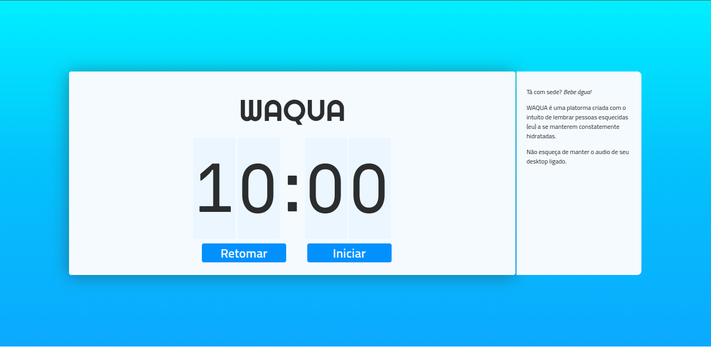

# WAQUA 🥤

Tá com sede? Bebe água!

WAQUA é uma platorma criada com o intuito de lembrar pessoas esquecidas (como eu) a se manterem constatemente hidratadas.

A cada 10 minutos um alerta sonoro é disparado. É possivel costumizar o intervalo de tempo, basta parar a contagem de tempo, clicar em um dos números e editar. 

Acesse: 
[https://waqua.vercel.app/](https://waqua.vercel.app/)




## Motivação 📜
A necessidade vital da ingestão de água, somada ao fator de que desenvolvedores passarem mais tempo com foco em seus computadores do que em seus celulares durante suas horas de trabalho.

## Funcionalidades ⏰
* Temporizador, com limite de tempo customizável 
* Alerta Sonoro, ao fim da contagem alerta sonoro será disparado (existem três variações de alertas disponíveis).
* Possibilidade de parar, retomoar ou restaurar o contador a qualquer instante.
* (Três variações da animação presente no  rodapé ).

## Pré-Requisitos 🧰
Para a execução local desta aplicação é necessario ter instalado em sua máquina as seguintes ferramentas:
[Git](https://git-scm.com), [Node.js](https://nodejs.org/en/). 


## Instalação 🔧
1. Clone o repositório
    ```bash
    $ git clone https://github.com/GilvanG/Waqua.git

    $ cd Waqua
    ```

2. Instale as dependências
    
    1. Instalando as dependências com [yarn](https://github.com/yarnpkg/yarn):
        ```bash
        $ yarn
        ```

    2. Instalando as dependências com [npm](https://github.com/npm/cli):
        ```bash
        $ npm install
        ```

## Executando 💻
1. Executando o projeto com [yarn](https://github.com/yarnpkg/yarn):
    ```bash
    $ yarn dev
    ```

2. Executando o projeto com [npm](https://github.com/npm/cli):
    ```bash
    $ npm run dev
    ```

Mediante a execução de um dos comandos acima o projeto se encontrará disponivel em [http://localhost:8888/](http://localhost:8888/)

## Tecnologias ⚙️

Aplicativo desenvolvido em [React](https://react.dev/) com [Typescript](https://www.typescriptlang.org/), utilizando [Vite](https://vitejs.dev/).

- Animações extraidas de [Lottie](https://lottiefiles.com/)
- Ícones de [Font Awesome](https://fontawesome.com/)
- Estilizado com [Styled Components](https://styled-components.com/)

